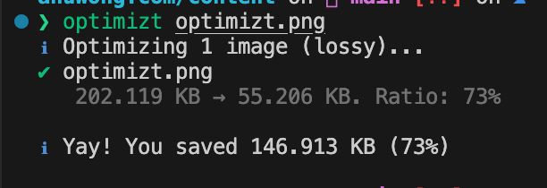

## รูปภาพกิน Bandwidth ของ Internet ไปกว่า 70%

ในการใช้งานอินเตอร์เน็ตทุกวันนี้ ส่วนมากเราจะเสพสื่อในรูปแบบของรูปภาพ และ วิดีโอ ซึ่งหลายเว็บไซต์ก็มักจะมีการแสดงผลรูปภาพในแต่ละส่วนของการทำงานแตกต่างกันไป บ้างก็ใช้เป็นภาพเพื่อการตลาด ใช้เป็น Call-to-Action หรืออาจจะใช้เพื่อแสดงสินค้าและบริการ ซึ่งกว่า 70% ของ traffic บนเว็บไซต์เหล่านี้ เกิดจากการโหลดข้อมูลรูปภาพ ดังนั้นการลดขนาดรูปภาพ จึงเท่ากับการลดปริมาณข้อมูลที่ต้องโหลด เป็นการเพิ่มความเร็วให้กับเว็บไซต์เราได้โดยตรง

[ค่าเฉลี่ยของขนาดของเว็บไซต์อยู่ที่ 2MB โดยครึ่งหนึ่งเป็นรูปภาพ](https://web.dev/learn/images/performance-issues/)

## ลดขนาดรูปภาพด้วยการบีบอัด

รูปภาพที่เราเห็นบนเว็บไซต์ส่วนใหญ่มักจะอยู่ในรูปแบบของไฟล์ภาพนามสกุล JPG, PNG, หรือ WEBP สำหรับเว็บยุคใหม่ อาจจะมาจากระบบ CMS ที่แอดมินทำการอัพโหลดรูปภาพขึ้นมา แล้วหน้าเว็บก็ไปดึงข้อมูลที่อยู่รูปภาพจาก CDN มาแสดงผล ในหลายครั้งรูปที่ถูกอัพโหลดขึ้นมาและ serve ให้ผู้ใช้นั้นไม่ได้ทำการบีบอัดรูปภาพ หรือทำการลดขนาดให้เหมาะกับอุปกรณ์มาก่อน ทำให้รูปนั้นอาจจะมีความละเอียดที่มากจนเกินไปสำหรับแสดงผลบนเว็บไซต์ หรือไฟล์ที่ใหญ่มากเกินไปสำหรับการโหลดผ่านเน็ตมือถือหรือ Slow 4G

เทคนิกในการลดขนาดรูปภาพนั้นมีหลายวิธี เช่น การทำ Progressive Image เป็นการทำรูปออกมาหลายๆ ขนาด เพื่อให้แสดงผลได้เหมาะสมสวยงามตามขนาดของอุปกรณ์ วิธีนี้ได้ผลลัพธ์ที่ดีมาก แต่ก็ต้องใช้แรงและทรัพยากรในการทำรูปหลายขนาดให้เหมาะสมและเข้ากับแต่ละหน้าจอ

อีกหนึ่งวิธีที่นิยมและทำได้ง่าย คือการบีบอัดด้วยโปรแกรม เช่น imagemagick, sharp.js, squoosh หรือ Photoshop ก็ทำได้ แต่วันนี้ผมจะแนะนำอีกหนึ่งโปรแกรมที่ใช้งานได้ง่าย สะดวกสำหรับ developer ที่ถนัดการใช้ Command Line นั่นก็คือ [Optimizt](https://github.com/funbox/optimizt) ซึ่งรองรับไฟล์ PNG, JPEG, SVG, และ GIF สามารถ compress and export ออกมาได้ทั้ง WEBP และ AVIF เลย

## วิธีการใช้งาน Optimizt

### ติดตั้ง Optimizt

```sh
npm i -g @funboxteam/optimizt
```

### ใช้งาน Optimizt

```sh
optimizt path/to/picture.jpg
```

รายละเอียดของ CLI สามารถเข้าไปดูที่ [GitHub](https://github.com/funbox/optimizt) ของทาง Optimizt ได้เลย

### ตัวอย่างการใช้งานของเรา

ก่อนที่เราจะ Deploy บทความใหม่ ถ้าบทความมีการใช้รูปภาพ เราก็จะ compress รูปนั้นก่อน เช่น

```sh
ls -l

total 408
drwxr-xr-x  11 anuwong.mon  staff     352 Aug 21 08:30 blog
-rw-r--r--   1 anuwong.mon  staff  206970 Aug 21 08:30 optimizt.png
```

จะเห็นว่าไฟล์รูป optimizt.png มีขนาด 206KB ซึ่งเราจะใช้ Optimizt ในการบีบอัดไฟล์นี้

```sh
optimizt optimizt.png

ℹ Optimizing 1 image (lossy)...
✔ optimizt.png
   202.119 KB → 55.206 KB. Ratio: 73%

ℹ Yay! You saved 146.913 KB (73%)
```

จะเห็นว่าไฟล์ optimizt.png ลดขนาดลงจาก 202KB เหลือเพียง 55KB ซึ่งเป็นการลดขนาดไฟล์ไปถึง 73% และเราจะได้ไฟล์ optimizt.png ที่มีขนาดเล็กลงมาใช้งานแทนไฟล์เดิมได้เลย



## Summary

จะเห็นได้ว่าเราสามารถเพิ่มความเร็วให้เว็บไซต์ของเราง่ายๆ เพียงใช้เครื่องมือที่เหมาะสม การเตรียมตัวที่ดี และการทำงานอย่างมีประสิทธิภาพ ซึ่งการลดขนาดรูปภาพก็เป็นหนึ่งในเครื่องมือที่ช่วยให้เราลดปริมาณข้อมูลที่ต้องโหลดลงได้ และเพิ่มความเร็วให้กับเว็บไซต์ของเราได้โดยตรง

ขอให้สนุกกับเขียนโค้ดนะครับ 🤓
